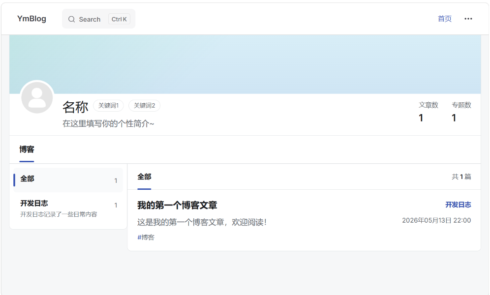
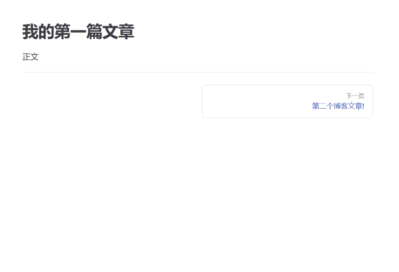

# 编写文章

所有的文章在仓库目录的 `docs/src/` 路径下编写。

我们在目录下创建一个 `first.md` 并编写以下内容：

```md
--
title: 我的第一个博客文章
date: 2026-05-13 22:00
summary: 这是我的第一个博客文章，欢迎阅读！
tags:
  - 博客
topic:
  name: 开发日志
  description: 开发日志记录了一些日常内容
--

# 标题

正文
```

- `title` 代表文章的标题
- `date` 表示文章发布的日期
- `summary` 表示文章的摘要，会显示到主页的文章描述栏
- `tags` 表示文章的标签内容
- `topic` 表示文章的主题，站点会自动根据主题分类文章
- `topic.name` 表示文章的主题名称
- `topic.description` 表示文章的主题简介

运行项目，你会在主页得到：



你也可以添加多个同主题的文章，它会被归类为同一个文集列表。

同一个文集列表的文章在预览时，会显示底部的上下页导航。

默认情况下，文章按照发布时间正序排序。

你可以在文章开头指定 `index` 指定了index的文章会被提前，越小的index排在越前方，你可以使用这个功能对文章进行手动排列。



